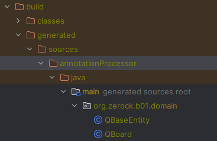

# 스프링에서 스프링 부트로

>## 5.1 스프링 부트 소개

스프링 부트는 스프링에서 파생된 여러 서브 프로젝트에서 시작해 이제는 완전한 메인 프로젝트 가되어버린 특이한 케이스다.<br>

스프링 부트는 엄밀히 말하면 '스프링 프레임 워크 개발 도구'라고 볼 수 있다. 스프링 부트는 엔터프라이즈급 앱을 개발하기 위해 필요한 기능을 제공하는 개발 도구다.

스프링 부트의 중요 특징으로 Auto Configuration(자동 설정)이 있다. 예를들어 스프링 부트는 데이터베이스와 관련 모듈을 추가하면 자동으로 관련 설정을 찾아 실행한다.

스프링만 이용하는 경우와 비교했을 때 **추가한 모듈에 대한 설정이 전혀 필요하지 않다**는 것이다.

또 다른 특징으로는 '내장 톰캣'과 단독 실행 가능한 도구라는 것이다. 별도의 서버 설정 없이 개발 및 실행 가능하다. 이를 이용해 스프링 부트 프로젝트를 jar 파일로 만들고 다른 OS에서 실행 하는 등의 작업이 가능하다.

- ### 기존 개발에서 달라지는 점

설정과 관련해 필요한 라이브러리를 기존 build.gradle파일에 추가하는 설정이 자동으로 처리되고, 내장 톰캣으로 WAS의 추가 설정이 필요하지 않다.

빈 설정은 XML대신, 자바 설정을 이용한다.

JSP를 이용했지만 스프링 부트는 Thymeleaf라는 템플릿 엔진을 이용한다. 최근 스프링 부트는 화면을 궝하지 않고 데이터만을 제공하는 API 서버라는 형태를 이용하기도 한다.

#### _스프링 부트의 프로젝트 생성 방식_

1. Spring Initializr를 이용한 자동 생성 // 대부분 사용
2. Maven이나 Gradle을 이용한 직접 생성.

#### _생성시 추가한 dependencies_

 - Spring Boot DevTools
 - Lombok
 - Spring Web
 - Thymeleaf
 - Spring Data JPA
 - MariaDB Driver

- ### 스프링 부트에서 웹 개발

스프링 부트에서 웹 개발은 컨트롤러나 화면 개발은 유사하지만, web.xml이나 servelt-context.xml과 같은 웹 관련 설정파일이 없다.

이러한 설정을 대신하는 클래스를 작성한다.

> ## 5.2 Thymeleaf

스프링과 마찬가지로 스프링 부트도 다양한 View 관련 기술을 적용할 수 있다. 이때 스프링 부트는 Thymeleaf라는 템플릿 엔진을 이용한다.

Thymeleaf는 '템플릿'이기 때문에 JSP처럼 직접 데이터를 생성하지 않고 만들어진 결과에 데이터를 맞춰 보여주는 방식이다.
JSP와 마찬가지로 서버에서 동작하기는 하지만, HTML을 기반으로 화면을 구성하기에 HTML에 좀 더 가까운 방식으로 작성된다.

- ### Thymeleaf 기초문법

Thymeleaf를 이요하기 위해 가장 중요한 설정은 '네임스페이스(xmlns)'에 Thymeleaf를 지정하는 것이다. 네임스페이스를 지정하면 `th:`를 통해 모든 기능을 사용할 수 있다.

#### _Thymeleaf출력_

Model로 전달된 데이터를 출력하기 위해 HTML 태그 내에 `th:...`로 시작하는 속성을 이용하거나 inlining을 이용한다.

#### _Thymeleaf 주석 처리_

에러가 난 부분을 찾기 위해 주석처리 할 때는 `<!--/* ... */-->`를 이용한다.<br>
주석을 사용하면 Thymeleaf가 파싱 처리할 때 삭제되어 처리되기에 잘못된 문법에 대한 체크도 건너뛸 수 있고, 삭제된 상태에서 처리되어 브라우저는 해당 부분은 결과 자체가 없다.

#### _th:with를 이용한 변수 선언_

임시로 변수를 선언해야 하는 상황에서는 `th:with`를 이용해 간단히 처리할 수 있다.<br>
`th:with = "name = value"` 형태로 ','을 이용해 여러 개 선언할 수 있다.

#### _반복문 제어문 처리_

반복문 처리는 크게 2가지 방법이 있다.
- 반복문이 필요한 테그에 `th:each`를 적용한다.
  * 기존의 HTML을 그대로 둔 상테에서 반복 처리를 할 수 있다.
  * 다만 JSTL과 조금 이질적인 형태이다.
- `<th:block>`이라는 별도의 태그를 이용한다.
  * 추가로 태그가 들어간다는 단점이 있다.

#### _반복문의 status 변수_

`th:each`를 처리할 때 현재 반복문의 내부 상태에 변수를 추가해 사용할 수 있다. 이를 status 변수라고 한다.
주로 index/count/size/first/last/odd/even 등을 이용해 자주 사용하는 값을 출력할 수 있다.

```html
<ul>
    <li th:each="str,status: ${list}">
<!--        각 인덱스 번호와 해당 str 값 출력-->
        [[${status.index}]] -- [[${str}]]
        
    </li>
</ul>
```

#### _th:if/unless/switch_

제어문의 형태로 위와 같은 코드를 이용할 수 있다.

`th:if`와 `th:unless`는 별도의 속성으로 사용할 수 있으므로 if else와는 조금 다르게 사용된다.
또한 '?'를 삼항 연산자로 그대로 사용할 수 있다.
```html
<ul>
    <li th:each="str,status: ${list}">
        <span th:if="${status.odd}">ODD -- [[{${str}]]</span>
        <span th:unless="${status.odd}">EVEN -- [[{${str}]]</span>
    </li>
</ul>
```
```html
<ul>
    <li th:each="str,status: ${list}">
        <span th:text="${status.odd} ? 'ODD --- ' + ${str} : 'EVEN ---'+ ${str} "></span>
    </li>
</ul>
```

`th:switch`는 `th:case`와 같이 사용하여 Switch 문을 처리할 때 사용할 수 있다.
```html
<ul>
    <li th:each="str,status: ${list}">
        <th:block th:switch="${status.index %3}">
            <span th:case="0">0</span>
            <span th:case="1">1</span>
            <span th:case="2">2</span>
        </th:block>
    </li>
</ul>
```

#### _Thymeleaf 링크 처리_

JSP를 이용할 때 '/'로 시작하는 것과 특정 프로젝트의 경로부터 시작하는 것을 모두 고려한느 건 번거롭지만, Thymeleaf는 '@'로 링크를 작성하기만 하면 된다.
```html
<a th:herf="@{/hello}">go to /hello</a>
```

#### _링크 쿼리 스트링 처리_
쿼리 스트링은 'key=value'의 형태로 파라미터를 처리할 때 사용되며 '()'를 이용해 파라미터의 이름과 값을 지정한다.
```html
<a th:herf="@{/hello(name='AAA', age=16}">go to /hello</a>
<!--/hello?name=AAA$age16-->
```
한글의 경우 자동으로 URL 인코딩 처리가 이루어진다.<br>
배열의 경우 또한 같은 이름의 파라미터를 자동으로 처리한다.

- ### Thymeleaf의 특별한 기능들


#### _인라인 처리_

상황에 따라 동일한 데이터를 다르게 출력해주는 인라인 기능을 자바스크립트를 사용할 때 편리하다.


#### _레이아웃 기능_

`<th:block>`을 이용하면 레이아웃을 만들고 특정한 페이지에서는 필요한 부분만을 작성하는 방식으로 개발이 가능하다.
레이아웃 기능을 위해 별도의 라이브러리가 필요하므로 build.gradle을 수정해야한다.

```build.gradle
depednecies{
// https://mvnrepository.com/artifact/nz.net.ultraq.thymeleaf/thymeleaf-layout-dialect
    implementation group: 'nz.net.ultraq.thymeleaf', name: 'thymeleaf-layout-dialect', version: '3.0.0'
}
```

```html
<!DOCTYPE html>
<html xmlns:th="http://www.thymeleaf.org"
      xmlns:layout="http://www.ultraq.net.nz/thymeleaf/layout"
      lang="en">
<head>
    <meta charset="UTF-8">
    <title>Title</title>
</head>
<body>
<div><h3>Sample Layout Header</h3></div>

<div layout:fragment="content">
    <p>Page content goes here</p>
</div>

<div>
    <h3>Sample Layout Footer</h3>
</div>
<th:block layout:fragment="scrip"></th:block>
</body>
</html>
```
네임스페이스에 레이아웃을 적용시킨다.<br>
`<layout:fragment>`속성을 이용하면 해당 영역은 나중에 다른 파일에서 해당 부분만을 개발할 수 있다.<br>
위 코드는 'content'와 'script' 부분을 fragment로 지정했다. 새로운 화면을 작성할 때 코드를 그대로 활용하면서 'content/script' 중 원하는 영역만을 작성할 수 있다.

> ## 5.3 Spring Data JPA

JPA는 간단하게 '자바로 영속 영역을 처리하는 API'라고 해석할 수 있다. JPA의 상위 개념은 ORM(Object Relational Mapping)이라는 패러다임으로 이어지는데 이는 '객체지향'으로 구성한 시스템을 관계형 데이터베이스에 매핑하는 패러다임이다.

>JPA에서 영속성은 Entitiy를 영구적으로 저장해주는 환경을 의미한다.
<br>
<br>

JPA는 스프링과 연동할 때 Spring Data JPA라는 라이브러리를 이용한다. 이는 JPA를 단독으로 활요할 때 보다 더 적은 양의 코드로 많은 기능을 활용할 수 있다는 장점이 있다.

<br>
CRUD의 경우 검색 조건에 따라 다른 쿼리가 실행될 수 있도록 해야한는데 Spring Data JAP의 경우 Querydsl 이나 jOOQ등을 이용한다.
국내에서는 Querydsl을 주로 이용한다.

- ### Board 엔티티와 JpaRepository

JPA를 이용하는 개발의 핵심은 객체지향을 통해 영속 계층을 처리하는데 있다. 따라서 JPA를 이용할 때 테이블과 SQL을 다루는 것이 아닌 데이터에 해당하는 객체를 엔티티 객체라는 것으로 다루고, JPA로 이를 데이터베이스와 연동해서 관리한다.

엔티티 객체는 쉽게 말해 PK를 가지는 자바의 객체이다.엔티티 객체를 위해 `@Entitiy`를 반드시 적용하고, 각각의 객체를 식별하기 위해 `@Id`를 이용해 구분한다.

auto increment를 이용하기 위해 `@GeneratedValue(strategy = GenerationType.IDENTITY)`를 적용한다.

이 외에도 자동으로 키를 생성하는 전략은 다음과 같다.
- IDENTITY : 데이터베이스에 위임(MySQL/MariaDB) - auto_increment
- SEQUENCE : 데이터베이스 시퀀스 오브젝트 사용 (ORACLE) -@SequenceGenerator 필요
- TABLE : 키 생성용 테이블 사용, 모든 DB에서 사용 - @TableGenerator 필요
- AUTO : 방언에 따라 자동 지정, 기본값

>표준 SQL 문법 외에 독자적인 기능을 가진 다양한 데이터베이스 제품이 존재하고, 각각의 데이터 베이스가 제공하는 문법과 함수에는 차이가 있다.
> 
> 이러한 차이를 방언(dialect)라고 하며 JPA는 종속되지 않은 추상화된 방언 클래스를 제공하고 있어 변경된 DBMS라도 자동으로 처리할 수 있다.

Spring Data JPA는 자동으로 객체를 생성하고 이를 통해 예외 처리 등을 자동으로 처리하는데 이를 위해 JapRepository 인터페이스를 제공한다.

#### _@MappedSuperClass를 이용한 공통 속성 처리_

데이터베이스의 거의 모든 테이블에는 데이터가 추가된 시간이나 수정된 시간 등이 공통으로 칼럼으로 작성된다.<br>

자바에서는 이를 쉽게 처리하고자 `@MappedSuperClass`를 이용해 공통으로 사용되는 칼럼들을 지정하고 해당 클래스를 상속해 처리한다.

이때 가장 중요한 부분은 자동으로 Spring Data JPA의 AuditingEntityListener를 지정하는 부분이다.
이를 적용하면 엔티티가 데이터베이스에 추가되거나 변경될 때 자동으로 시간 값을 지정할 수 있다.

AuditingEntityListener를 활성화 시키기 위해서는 프로젝트 설정에 `@EnableJpaAuditing`을 추가해야만 한다.

#### _JpaRepository 인터페이스_

Spring Data JPA를 이용할 때 JpaRepository라는 인터페이스를 이용해 인터페이스 선언만으로 데이터베이스 관련 작업을 어느 정도 처리할 수 있다.

개발 단계에서 JpaRepository 인터페이스를 상속하는 인터페이스를 선언하는 것만으로 CRUD와 페이징 처리가 모두 완료된다.

다만 JpaRepository 인터페이스를 상속할 떄에는 엔티티 타입과 @Id 타입을 지정해 주어야 하는 점을 제외하면 아무런 코드가 없이도 개발이 가능하다.


#### _JpaRepository insert_

데이터베이스에 insert를 실행하는 기능은 JpaRepository의 save()를 통해 이루어진다.<br>
save()는 현재의 영속 컨텍스트 내에 데이터가 존재하는 찾아보고 해당 엔티티 객체가 없을 때는 insert, 존재할 때는 update를 자동으로 실행한다.

#### _JpaRepository select_

특정한 번호의 게시물을 조회하는 기능은 findById()를 이용해서 처리한다.<br>
특이하게도 findById()의 리턴 타입은 Optional<T>이다.

#### _JpaRepository update_

update기능은 insert와 동일하게 save()를 통해 처리된다. 동일한 @Id 값을 가지는 객체를 생성해서 처리할 수 있다.<br>
update는 등록 시간이 필요하므로 가능하면 findById()로 가져온 객체를 이용해서 약간의 수정을 통해 처리하자.

일반적으로 엔티티 객체는 가능하면 최사한의 변경이나 변경이 없는 불변(immutabele)하게 설계하는 것이 좋지만, 반드시 강제적인 사항은 아니므로 Board 클래스에 수정이 가능한 부분을 미리 메소드로 설계한다.(setter)

#### _JpaRepository delete_

delete는 @Id에 해당하는 값으로 deleteById()를 통해 실행할 수 있다.

<br>

>수정이나 삭제시 굳이 select 문이 먼저 실행되는 이유를 고민할 필요가 있다.<br>
>JPA를 이용하는 것은 엄밀히 말하면 영속 컨텍스트와 데이터베이스를 동기화해서 관리한다는 의미이다. 그러므로 특정 엔티티 객체가 추가되면 영속 컨텍스트에 추가하고, 데이터베이스와 동기화가 이러어져야 한다.
> 마찬가지로 수정이나 삭제를 한다면 영속 컨텍스트에 해당 엔ㄷ티티 객체가 존재해야만 하므로 먼저 select로 엔티티 객체를 영속 컨텍스트에 저장해서 이를 삭제한 후에 delete가 이루어 진다.

#### _Pageable과 Page<E>타입_

페이징 처리는 Pageable이라는 타입의 객체를 구성해서 파라미터로 전달하면 된다.<br>
Pageable은 인터페이스로 설계되어이쏙, 일반적으로는 PageRequest.of()의 기능을 이용해 개발이 가능하다.

- PageRequest.of(페이지 번호,사이즈) : 페이지 번호는 0부터
- PageRequest.of(페이지 번호,사이즈,Sort) : 정렬 조건 추가
- PageRequest.of(페이지 번호,사이즈,Sort.Direction,속성 ...) : 정렬 방향과 여러 속성 지정

파라미터로 Pageable을 이용하면 리턴 타입은 Page<T>타입을 이용할 수 있는데 이는 단순 목록뿐 아니라 페이징 처리에 데이터가 많은 경우에는 count 처리를 자동으로 실행한다.<br>

대부분의 Pageable 파라미터는 메소드 마지막에 사용하고, 파라미터에 Pageable이 있는 경우 메소드의 리턴 타입을 Page<T>로 설계한다.

<br>

JpaRepository에는 findAll()이라는 기능을 제공하여 기본적인 페이징 처리를 지원한다.

findAll()의 리턴 타입으로 나오는 Page<T>타입은 내부적으로 페이징 처리에 필요한 여러 정보를 처리한다. <br>
예를 들어 다음 페이지가 존재하는지, 이전 페이지가 존재하는지, 전체 데이터의 개수는 몇 개인지 등의 기능을 모두 알 수 있다.

<br>

#### _쿼리 메소드와 @Query_

<br>

**쿼리 메소드**는 보통 SQL에서 사용하는 키워드와 칼럼을 결합해 구성하면 그 자체가 JPA에서 사용하는 쿼리가 되는 기능이다.<br>
일반적으로 메소드 이름은 'findBy...', 'get...'으로 시작하고 칼럼명과 키워드를 결합하는 방식으로 구성한다.

다 실제 사용하려면 상당히 길고 복잡한 메소드를 작성하게 되는 경우가 많다.
>제목에 특정한 키워드가 존재하는 게시글들을 bno의 역순으로 정렬해서 가져온다.
> Page<Board> findByTitleContainingOrderByBnoDesc(String keyword, Pageable pageable);

그래서 쿼리 메소드는 주로 단순한 쿼리를 작성할 때 사용하고, 실제 개발에서는 많이 사용되지 않는다.


이와 유사하게 별도의 처리 없이 `@Query`로 JPQL을 이용할 수 있다.

`@Query`어노테이션의 value로 작성하는 문자열을 JPQL이라고 하는데 SQL과 유사하게 JPA에서 사용하는 쿼리 언어라고 생각하면 된다.
JPA는 데이터베이스에 독립적으로 개발이 가능하므로 특정 데이터베이스에서만 동작하는 SQL 대신 JPA에 맞게 사용하는 JPQL을 사용하는 것이다.

JPQL은 테이블 대신 엔티티 타입을 이용하고 칼럼 대신 엔티티 속성을 이용해 작성된다. JPQL은 SQL을 대신하는 용도로 사용하기 떄문에 SQL에 존재하는 여러 키워드나 기능들이 거의 유사하게 제공된다.
>@Query("select b from Board b where b.title like concat('%',:keyword,'%')")
> Page<Board> findkeyword(String keyword, Pageable pageable);

@Query를 이용하면 크게 쿼리 메소드가 할 수 없는 몇가지 기능을 할 수 있다.
- 조인과 같이 복잡한 쿼리를 실행할 수 있다.
- 원하는 속성들만 추출해 Object[]나 DTO로 처리할 수 있다.
- nativeQuery속성값을 true로 지정해 특정 데이터베이스에서 동작하는 SQL을 사용할 수 있다.

- ### Querydsl을 이용한 동적 쿼리 처리

JPA나 JPQL을 이용하면 무척 편리하지만, 어노테이션을 이용해 지정하기 때문에 고정된 형태라는 단점이 있다.

예를들어 검색 기능에서 '제목/내용/작성자'와 같이 단일 조건 외에도 '제목과 내용', '제목과 작성자' 등 복합적인 검색 조건이 생길 수 있고 이에 따른 모든 경우의 수를 별도의 메소드로 작성하는 것은 어렵다.

이러한 문제의 근본 원인은 JPQL이 정적으로 고정되기 떄문이다. 이를 해별하기위해 국내에서 가장 많이 사용되는 방식은 **Querydsl**이다.

<br>

엄밀히 말하면 Querydsl은 JPA의 구현체인 Hibernate 프레임워크가 사용하는 HQL(Hibernate Query Language)을 동적으로 생성할 수 있는 프레임워크지만 JPA를 지원한다.

Querydsl을 이용하면 자바 코드를 이용하기 떄문에 타입의 안정성을 유지한 상태에서 쿼리를 작성할 수 있따.

이를 이용하기 위해서 Q도메인이라는 존재가 필요한데 Q도메인은 Querydsl의 설정을 통해 기존 엔티티 클래스를 Querydsl에서 사용하기 위해 별도의 코드로 생성하는 클래스이다.

```build.gradle
//queryDsl 설정
    implementation "com.querydsl:querydsl-jpa:${queryDslVersion}:jakarta"
    annotationProcessor(
            "jakarta.persistence:jakarta.persistence-api",
            "jakarta.annotation:jakarta.annotation-api",
            "com.querydsl:querydsl-apt:${queryDslVersion}:jakarta"
    )
```

- Q도메인 생성 및 querydsl을 위해 위 코드를 build.gradle에 추가한다.
- gradle의 other > compileJava를 실행한다.
- 만들어 둔 엔티티에 대해 build에 Q도메인이 추가된다.


#### _기존 Repository와 Querydsl 연동_

Querydsl을 기존 코드에 연동하기 위해 다음과 같은 과정으로 작성한다.

- Querydsl을 이용할 인터페이스 선언 (BoardSearch)
- "인터페이스 이름 + Impl"의 이름으로 클래스 선언 / 이때 QuerydslRepositorySupport라는 부모 클래스를 지정하고 인터페이스 구현 (BoardSearchImpl)
- 기존 Repository에는 부모 인터페이스로 Querydsl을 위한 인터페이스 지정. (BoardRepository)

#### _기존 Repository와 Querydsl 연동_

Querydsl의 목적은 '타입' 기반으로 '코드'를 이용해 JPQL쿼리를 생성하고 실행하는 것이다. <br>

아때 코드를 만드는 대신 클래스가 Q도메인 클래스이다. 따라서 Q도메인을 이용한 코드를 작성한다.
```Java
public class BoardSearchImpl extends QuerydslRepositorySupport implements BoardSearch {

    public BoardSearchImpl() {
        super(Board.class);
    }

    @Override
    public Page<Board> search1(Pageable pageable) {
        QBoard board = QBoard.board; //Q도메인 객체
        JPQLQuery<Board> query = from(board);
        query.where(board.title.contains("1"));

        //paging
        this.getQuerydsl().applyPagination(pageable,query);

        List<Board> list = query.fetch(); //JPQLQuery 실행
        long count = query.fetchCount(); // count 쿼리 실행

        return null;
    }
}
```

JPQLQuery는 @Query로 작성했던 JPQL를 코드를 통해 생성할 수 있게 한다. 이를 통해 where나 group by, join 처리 등이 가능하다. <br>

실행은 fetch()기능을 이용하고, fetchCount()를 이용하면 count쿼리를 실행할 수 있다.

#### _Querydsl로 Pageable 처리_

Querydsl의 실행 시 Pageable을 처리하는 방법은 상속한 QuerydslRepositorySupport 클래스의 기능을 이용한다. <br>

`this.getQuerydsl().applyPagination(pageable,query);`을 적용하여 실행되는 쿼리의 마지막에는 MariaDB가 페이징 처리에 사용하는 limit가 적용된다.